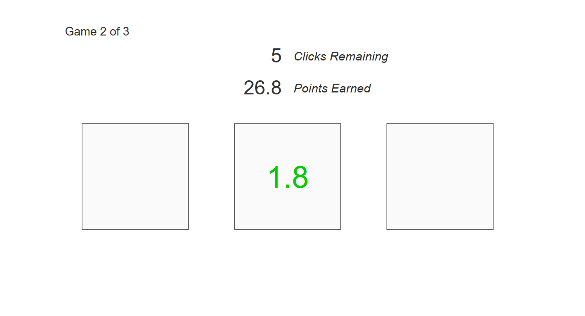

```{r, echo=FALSE, out.width="600px", fig.cap="Screenshot of the three armed bandit task - default example."}

```


## Default Example

* Run ShinyBandit: `callApp("Bandit", "run")`
* Show App Code: `callApp("Bandit", "show")`

## Description

The ShinyPsych - Bandit Task, as in the default example, is an implementation of a three armed bandit task [@sutton1998reinforcement], created with the ShinyPsych package. In a bandit task, the participant is presented with different options - the number of options is the number of arms the bandit has - from which he can choose a fixed number of times. Each option has an underlying distribution of values. When a participant clicks an option, a value from that distribution is drawn, shown to the participant and added to (or subtracted from) the participant's total point values. Thus the participant can learn about the options' underlying distributions by clicking the different options and make a more educated decision in each trial.

The bandit task has been used in decision making research to investigate the exploration-exploitation tradeoff [@cohen2007should].

ShinyPsych supports two to six arms, each of which can have a different underlying distribution type (e.g. a three Armed Bandit with $Opt1 \sim\mathcal{N}(\mu, \sigma)$, $Opt2 \sim uniform(min, max)$ and $Opt3 \sim exgauss(\mu, \sigma, \tau)$).

## Common Extensions

For a full description of the layout of the code underlying ShinyPsych - Bandit, click here [ShinyPsych - Bandit Code Description](ShinyPsych_BanditCode.html). Here is a brief description of some ways you can easily extend ShinyPsych - Bandit:

### Define specific outcome distributions

To specify outcome distributions, you have to create a list, in which you specify the options' distribution type(s) and then give it to `createBanditList()`. To do this, you can use the following template:

```{r, eval=FALSE}
# prepare a list with game parameters
banditDistList <- list("nTrials" = c(5, rep(10, 3)),  # trials for practice trial and game trials
                       "distributionType" = matrix(   # draw values from different distributions
                         rep(c("unif", "normal", "exgauss"), 5),
                         ncol = 3, byrow = TRUE),
                       "mean" = matrix(c(NA, 6, NA, rep(c(NA, 4, NA), 3)), # arguments for
                                       ncol = 3, byrow = TRUE),            # normal dist
                       "sd" = matrix(c(NA, 2, NA, rep(c(NA, 3, NA), 3)), # arguments for
                                     ncol = 3, byrow = TRUE),            # normal dist
                       "min" = matrix(c(-1, NA, NA, rep(c(-3, NA, NA), 3)), # arguments for
                                      ncol = 3, byrow = TRUE),              # uniform dist
                       "max" = matrix(c(5, NA, NA, rep(c(6, NA, NA), 3)), # arguments for
                                     ncol = 3, byrow = TRUE),             # uniform dist
                       "mu" = matrix(c(NA, NA, 3, rep(c(NA, NA, 4.5), 3)), # arguments for
                                         ncol = 3, byrow = TRUE),          # exgauss dist
                       "sigma" = matrix(c(NA, NA, 4, rep(c(NA, NA, 5), 3)), # arguments for
                                         ncol = 3, byrow = TRUE),           # exgauss dist
                       "tau" = matrix(c(NA, NA, 0, rep(c(NA, NA, 2), 3)), # arguments for
                                      ncol = 3, byrow = TRUE),            # exgauss dist
                       "positive" = matrix(c(NA, NA, FALSE, rep(c(NA, NA, FALSE), 3)), 
                                      ncol = 3, byrow = TRUE)) # arguments for exgauss dist

```

You simply specify the number of trials per game, the distribution types and the arguments these distribution functions need (possible distributions are "normal" - uses rnorm, "unif" - uses runif, "beta" - uses rbeta, "exp" - uses rbeta and "exgauss" - uses rexgauss from the retimes package). The distribution types and arguments have to be specified as matrices with number of colums equal to the number of options and number of rows equal to the number of games. Not used positions can be filled with NA (as in the example above), or with any number, since they will not be used.

To use the same outcomes for all participants, you can generate the outcome list once and save it as rds and then load this file both via `createBanditList()`.

### Change number of games

To change the number of games played per participant, you need to adjust the numbers given to *nTrials* in the banditDistList from above aswell as the number of rows of the distribution types and argument matrices.

### Change number of arms

To change the number of arms of the bandit task, you need to adjust the number of columns in the distributin types and argument matrices of the banditDistList from above. Then you need to adjust the *nArms* argument in `includeScriptFiles()` and `multiArmedBanditPage()`

## References
