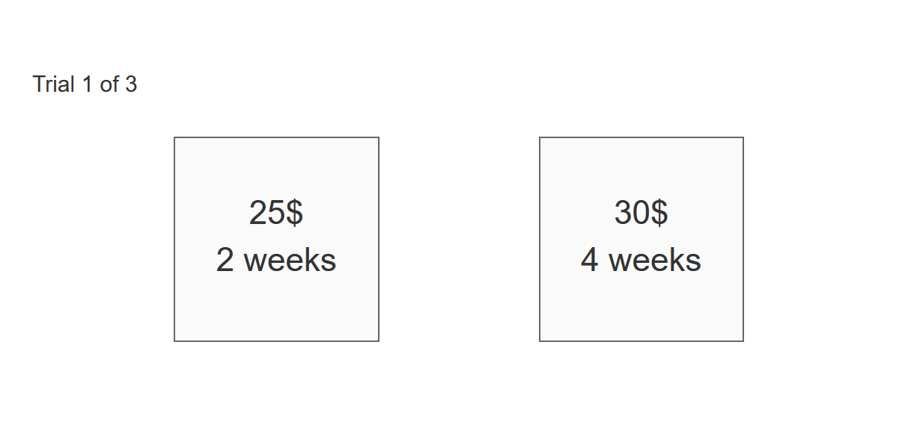

```{r, echo=FALSE, out.width="600px", fig.cap="Screenshot of the DD Task - default example."}

```


## Default Example

* Run ShinyBandit: `callApp("DD", "run")`
* Show App Code: `callApp("DD", "show")`

## Description

ShinyPsych - DD Task, is an implementation of the delay discounting task [@richards1999delay], created with the ShinyPsych package. 

The DD task is designed to measure a persons impulsivity/ ability to delay rewards. In the DD task, the participant is presented two outcomes, each of which she can receive after an indicated time period. The normal structure is that the participant is presented with a smaller outcome which she could get sooner, or a larger reward which she could get later. The participant then has to indicate his preference by choosing one of the outcome-time pairs.

The DD task has been used in decision making and clinical research to investigate impulsivity and the aspect of time in decisions [e.g. @mcclure2004separate; @green2004discounting; @wulff2017modeling].

With ShinyPsych you can read in your own file containing the decision problems.

## Common Extensions

For a full description of the layout of the code underlying ShinyPsych - DD Task, click here [ShinyPsych - DD Task Code Description](ShinyPsych_DDCode.html). [Click here](ShinyPsych_DDFiles.html) For a brief tutorial on how to create files with the decision problems.

## References
